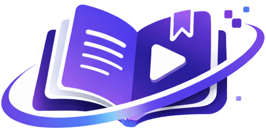

<div align="center">
  <h1>Knowte</h1>
  
</div>

**Transform lecture audio into structured learning materials — completely private, fully offline.**

Knowte is a desktop application that turns lecture recordings into structured notes, interactive quizzes, flashcards, mind maps, and related research papers. All processing happens locally on your machine using [Ollama](https://ollama.ai) for LLM inference and [Whisper](https://github.com/openai/whisper) for transcription. No data ever leaves your device.

---

## Demo


---

## Features

- 🎙️ **Audio & Video Input** — Upload audio/video files or record directly from your microphone. Supports MP3, WAV, M4A, OGG, WebM, MP4, MKV, and more.
- 📺 **YouTube Import** — Paste a YouTube URL and Knowte downloads and transcribes the audio using `yt-dlp`.
- 📝 **Transcription** — Local speech-to-text using [Whisper.cpp](https://github.com/ggerganov/whisper.cpp) with model sizes from tiny (~75 MB) to large (~3 GB).
- 📖 **Structured Notes** — LLM-generated notes organised into topics, key points, examples, key terms, and takeaways.
- ✅ **Interactive Quiz** — Auto-generated multiple choice, true/false, and short-answer questions with explanations and score tracking.
- 🃏 **Flashcards** — Anki-style flashcards with card-flip animations, three-pile study mode, and Anki `.apkg` / `.txt` export.
- 🧠 **Mind Map** — Visual tree of lecture concepts using React Flow, with PNG and SVG export.
- 🔬 **Research Papers** — Related academic papers via the Semantic Scholar API (optional, requires internet).
- 💡 **Explain This** — Select any text and get a contextual AI explanation, with "simpler" / "deeper" controls.
- 📚 **Lecture Library** — Persistent SQLite-backed history of all lectures with full-text search.
- 🔒 **100% Local & Private** — No cloud API calls (except the optional Semantic Scholar paper search). Audio and transcripts never leave your machine.

---

## Prerequisites

### 1. Ollama

Ollama runs language models locally. Download and install it from **[ollama.ai](https://ollama.ai)**, then pull a model:

```bash
# Recommended — good balance of quality and speed (~4.7 GB)
ollama pull llama3.1:8b

# Lightweight option (~2.3 GB)
ollama pull phi3:mini
```

Verify it's running:

```bash
curl http://localhost:11434/api/tags
```

### 2. ffmpeg

Knowte bundles platform-specific `ffmpeg` and `yt-dlp` binaries. For development see [CONTRIBUTING.md](docs/CONTRIBUTING.md).

---

## Quick Start

1. **Install prerequisites** (Ollama + a model — see above)
2. **Download Knowte** from the [Releases](../../releases) page and install it
3. **On first launch**, the setup wizard guides you through:
   - Verifying Ollama is running
   - Choosing a language model
   - Downloading a Whisper transcription model
   - Setting your academic level for personalised outputs
4. **Upload a lecture** — drag and drop an audio/video file, or paste a YouTube URL
5. **Click "Process Knowte"** — Knowte transcribes and generates all materials automatically

---

## Building from Source

### Requirements

| Tool | Version | Install |
|------|---------|---------|
| [Rust](https://rustup.rs) | stable | `curl --proto '=https' --tlsv1.2 -sSf https://sh.rustup.rs \| sh` |
| [Bun](https://bun.sh) | ≥ 1.0 | `curl -fsSL https://bun.sh/install \| bash` |
| Tauri CLI | v2 | included in `devDependencies` |
| Ollama | any | [ollama.ai](https://ollama.ai) |

### Development

```bash
git clone https://github.com/your-username/knowte.git
cd knowte
bun install
bun run tauri dev
```

### Production Build

```bash
npx tsc --noEmit       # Type-check
bun run tauri build    # Build installer
```

Build artefacts are in `src-tauri/target/release/bundle/`:

| Platform | Formats |
|----------|---------|
| Linux | `.deb`, `.AppImage`, `.rpm` |
| macOS | `.dmg` |
| Windows | `.msi`, `.exe` (NSIS) |

---

## Tech Stack

| Layer | Technology |
|-------|------------|
| Runtime | [Tauri v2](https://v2.tauri.app/) |
| Frontend | [React 19](https://react.dev/) + TypeScript |
| Styling | [Tailwind CSS v4](https://tailwindcss.com/) + CSS custom properties |
| State | [Zustand](https://github.com/pmndrs/zustand) |
| Routing | [React Router v7](https://reactrouter.com/) |
| Bundler | [Vite 7](https://vitejs.dev/) |
| Database | SQLite via [rusqlite](https://github.com/rusqlite/rusqlite) |
| Transcription | [whisper.cpp](https://github.com/ggerganov/whisper.cpp) via whisper-rs |
| LLM | [Ollama](https://ollama.ai) local HTTP API |
| Mind Map | [React Flow (@xyflow/react)](https://reactflow.dev/) |
| Audio Download | [yt-dlp](https://github.com/yt-dlp/yt-dlp) + [ffmpeg](https://ffmpeg.org/) |

---

## Data & Privacy

All user data — audio files, transcripts, notes, quizzes, flashcards — lives in SQLite in the platform app data directory:

| Platform | Path |
|----------|------|
| Linux | `~/.local/share/com.knowte.app/` |
| macOS | `~/Library/Application Support/com.knowte.app/` |
| Windows | `%APPDATA%\com.knowte.app\` |

The **only** optional external network call is to [Semantic Scholar](https://www.semanticscholar.org/product/api) for related paper search (disable in Settings → Research).

---

## License

GPL 3.0 License — see [LICENSE](docs/LICENSE) for details.

---

## Contributing

See [CONTRIBUTING.md](CONTRIBUTING.md) for details.
